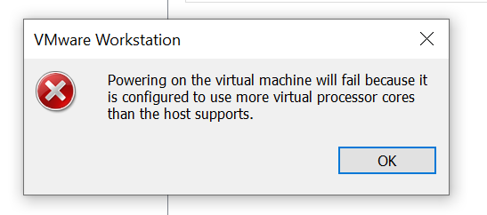
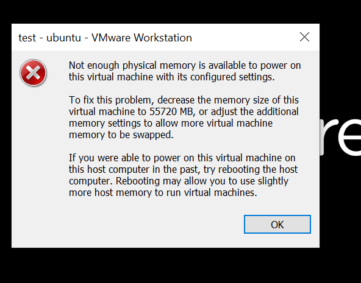

Wir benutzen VMWare Workstation

Ich vermute es handelt sich um einen Typ 2, weil ich glaube, das es ohne Windows nicht gehen würde

Logische Prozessoren vom Host: 12

## Was passiert, wenn ich meiner VM mehr logische Prozessoren zuweise als ich habe

## Was passiert beim RAM?
Es gibt keine Warnung / Fehlermeldung beim setzen des RAMs:

Beim starten der VM aber schon: 

## Warum bekomme ich Fehlermeldungen
Sonst würde die VM später auf Hardware zugreifen, die nicht existiert und wahrscheinlich abstürzen

Ich habe online nachgeschaut und meine Vermutung, dass es sich um einen Typ 2 handelt hat sich bestätigt: https://www.redhat.com/en/topics/virtualization/what-is-a-hypervisor?_x_tr_sl=en&_x_tr_tl=de&_x_tr_hl=de&_x_tr_pto=rq
