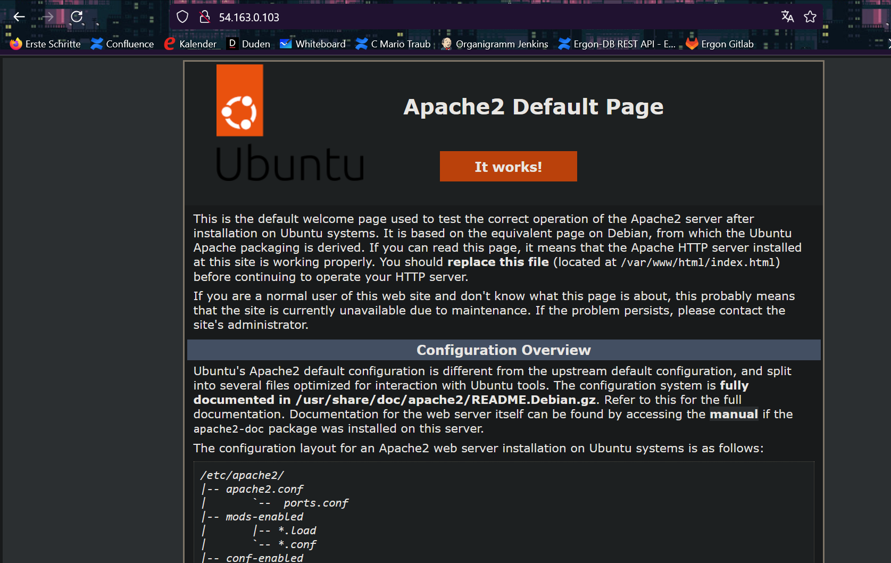
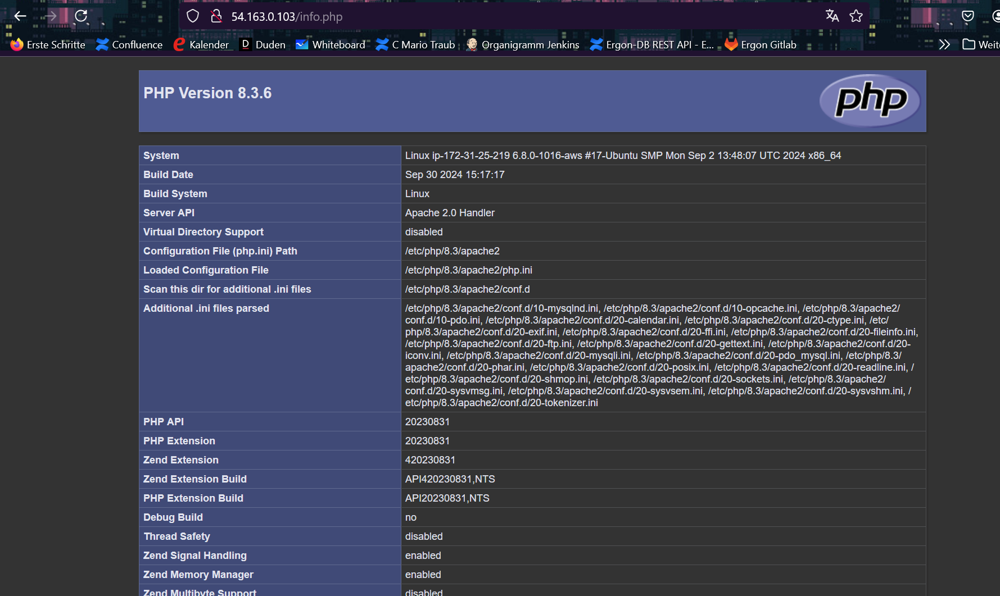
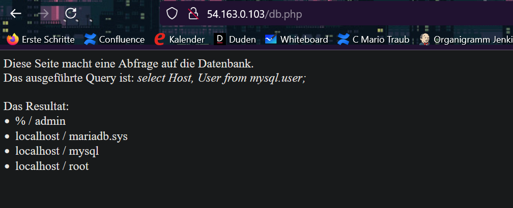
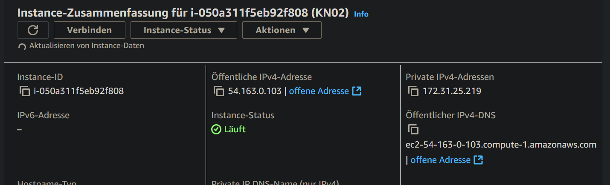
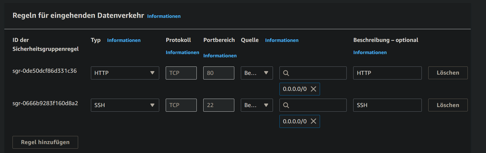
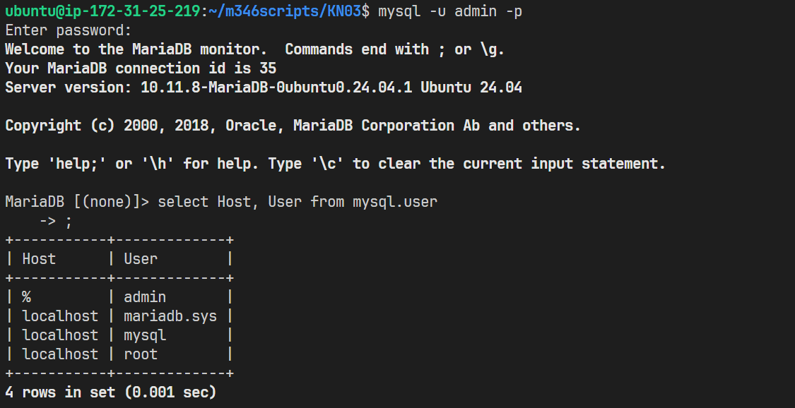

## Erstellen Sie Screenshots der funktionierenden Webseiten (mit sichtbarer URL).
- index.html

- info.php

- db.php

## Screenshot der Details der Instanz mit sichtbarer öffentlichen IP.

## Screenshot der Regeln der Sicherheitsgruppe

## Screenshot des Befehls zum einloggen in die mysql Konsole und das entsprechende Resultat der Abfrage.

## Kurze Erklärung was Ihre Abfrage ausliest.
Es liest jeden Host und User aus der mysql.user-Tabelle