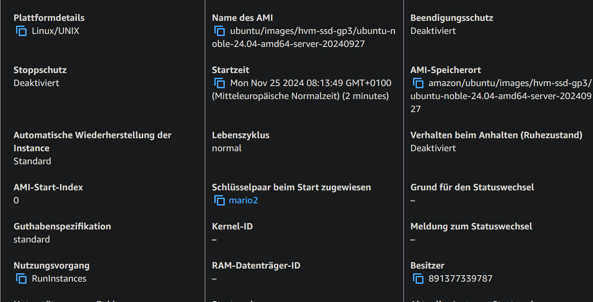
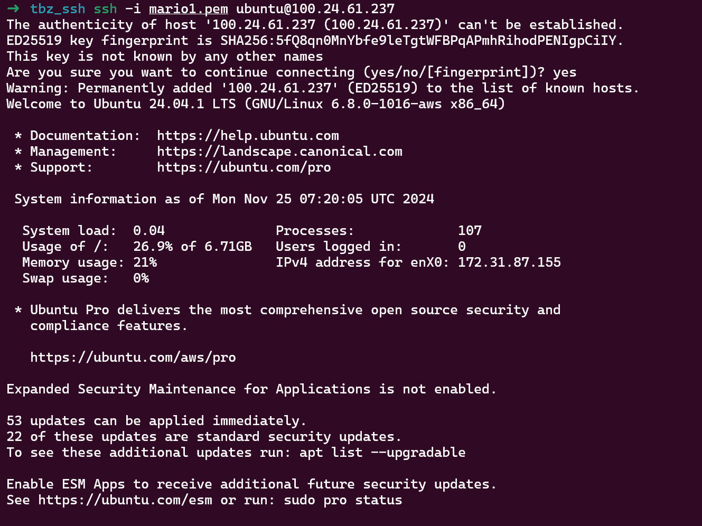
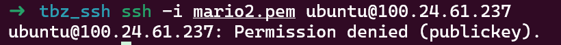

## Zeigen Sie nun, dass Sie nur mit dem ersten privaten Key aus der Cloud-Init Datei einloggen können.
1. Key:
Zeigen Sie nun, dass Sie nur mit dem ersten privaten Key aus der Cloud-Init Datei einloggen können.

2. Key


## Screenshot mit dem Auszug aus dem Cloud-Init-Log. Der Befehl den Sie aufgerufen haben und der obere Teil des Logs sollten sichtbar sein. Sie müssen nicht das gesamte Log abgeben.
```bash
scp -i mario1.pem ubuntu@100.24.61.237:/var/log/cloud-init-output.log /mnt/c/Users/mtraub/Desktop/Repositorys/m346/kn04
```

[cloud-init-output.log](./cloud-init-output.log)

## Aufgabe D
[Aufgabe D](./d/aufgaben.md)