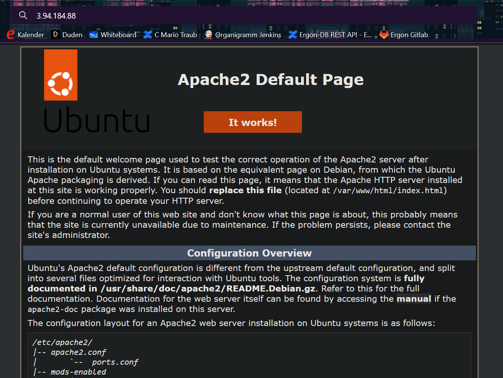
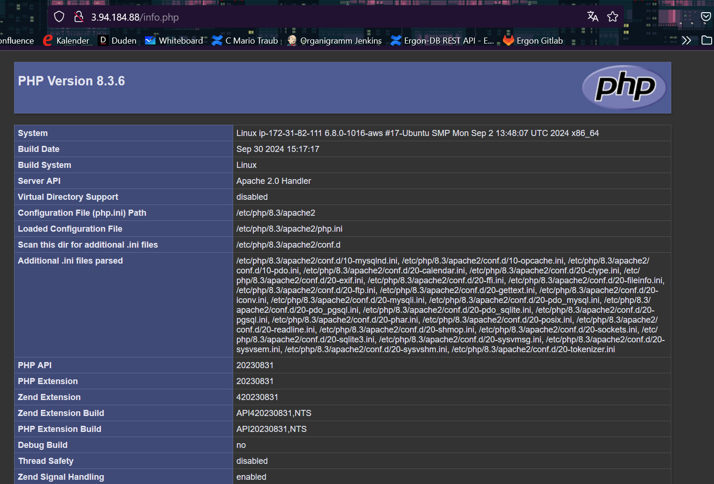
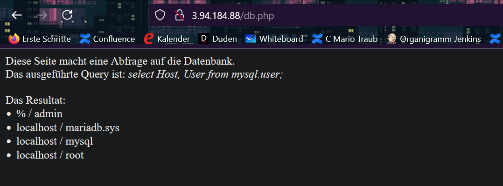
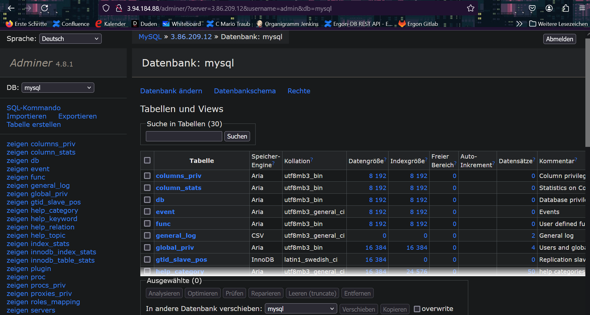

## Rufen Sie die Seiten index.html, info.php und db.php auf und erstellen Sie einen Screenshot der URL und des Inhalts.

## Rufen Sie Adminer auf  (http://ihre-ip/adminer/), verbinden Sie sich mit dem DB-Server und zeigen Sie mit Screenshots, dass die Verbindung funktioniert.
