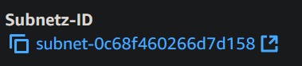

## Erklären Sie beide Begriffe VPC und Subnet mit eigenen Worten. Wie viele Subnets haben Sie bereits vordefiniert?
VPC ist eine virtual private Cloud. Also ein kleines Virtuelles Netzwerk
Subnets sind kleinere Teile in einem VPC
5
## Decken die IP Ranges des Subnets den gesamten IP Range des VPC ab?
Nein, nur einen Teil
## Erklären Sie den Unterschied zwischen einer öffentlichen und einer private IP. Was ist eine statische IP?
Öffentliche IPs sind über das Internet aufrufbar, private nur über das lokale Netzwerk
Statische IPs ändern sich nie und bleiben immer gleich, anders als dynamische IPs die sich regelmässig verändern

## Finden Sie heraus in welchem Subnet Ihre Instanz aus der vorherigen KN04 liegt. Dies finden Sie in den Details der Instanz. Geben Sie nun dem Subnet den Namen Sub-KN04.

## Definieren Sie die beiden private IPs
- Web: 172.31.64.10
- DB: 172.31.64.20

# Sicherheitsgruppen

## Webserver

## DB

# Statische IP

# Zeigen Sie, dass Sie immer noch alle drei Seiten aufrufen können

# Screenshot der Liste der Instanzen, wenn beide Instanzen gestoppt sind. Die Werte der öffentlichen und private IPs und der Status (gestoppt) müssen sichtbar sein.

Web: 

Subnet:
web: 

db: 

