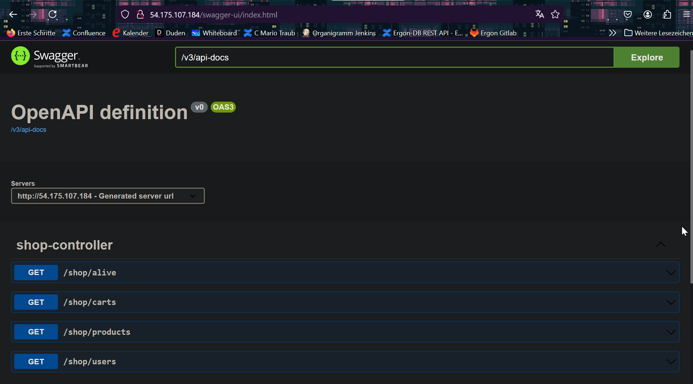
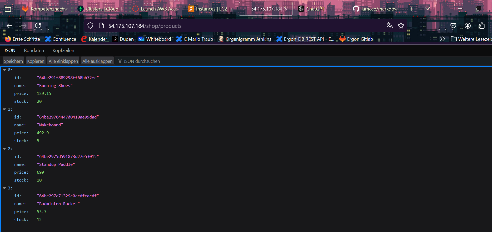
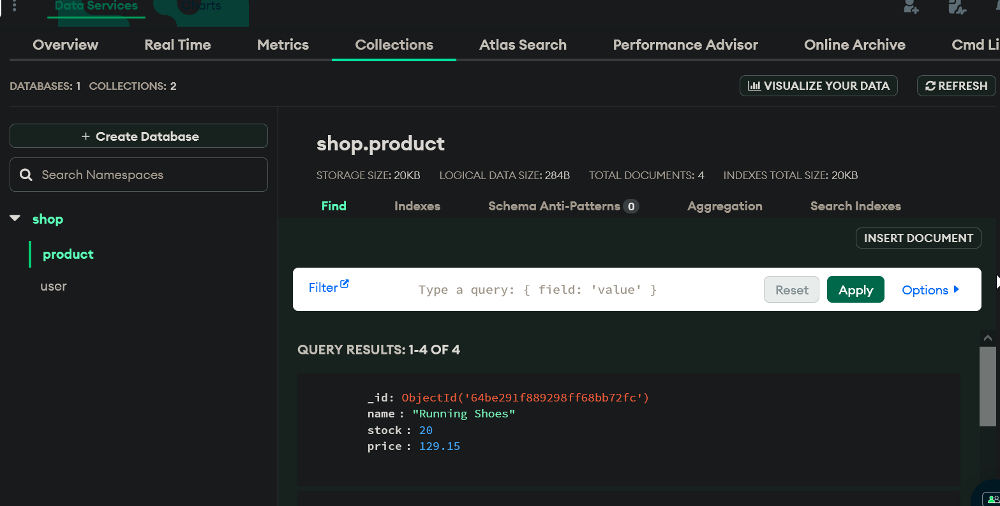
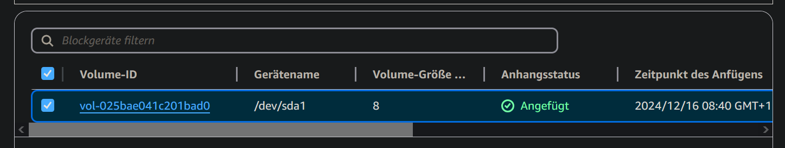
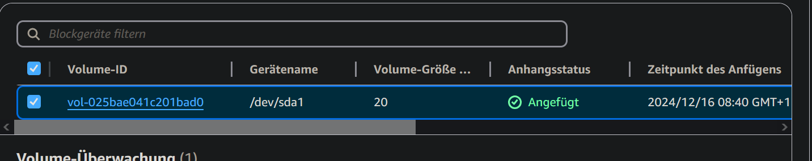
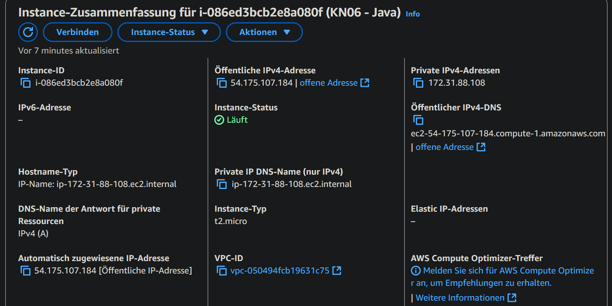
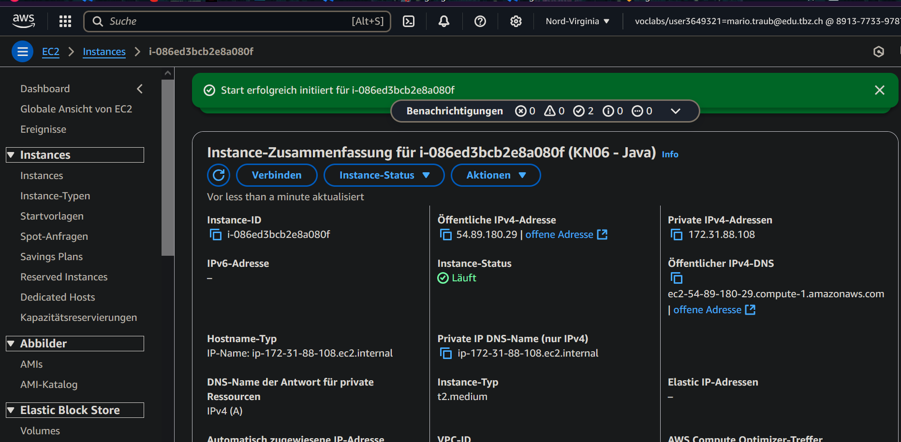
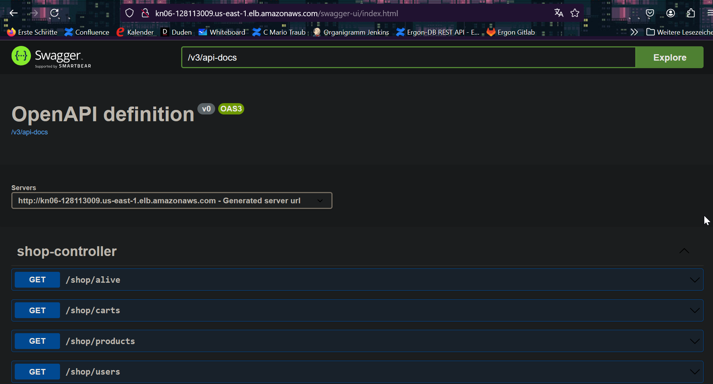
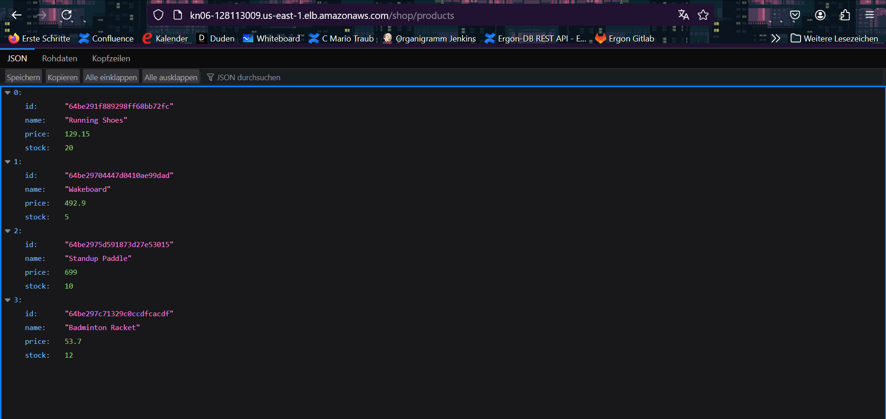

# A) Installation App
## Kurze Erklärung in eigenen Worten was ein Reverse Proxy ist.
Ein Vermittler zwischen dem Client und einem Server. Er schickt die Anfrage des Clients an den Server weiter und gibt seine Antort an den Client zurück. Dabei wird der Client nicht redirected.
## Screenshot der zeigt, dass Sie die Swagger-URL aufrufen können.

## Screenshot der zeigt, dass sie den Endpoint products (Java), respGetProducts (.NET) aufrufen können (via Swagger) und auch ein korrektes Resultat bekommen.

## Screenshot einer der MongoDB Collections mit Auszug aus dem Inhalt.

## Schauen Sie sich das Cloud-Init genau an. Welche(r) Teil(e) macht/machen hier überhaupt keinen Sinn in einer produktiven Umgebung?
- Bei runcmd werden noch packages installiert.
- 2 Programme auf der selben Maschiene
- 2 Webserver
- Credentials sind direkt im File
- DB wird bei jedem Start einer Instanz gelöscht und neu gefüllt
# B) Vertikale Skalierung
## Disk erweitern
### Vorher

### Nachher 

## Erklären Sie die Schritte die notwendig waren.
1. Instanz öffnen und zu Speicher Tab gehen
2. Volume öffnen
3. Button ändern anclicken
4. 20 GiB auswählen, wo vorher 8 GiB stand
## Geht dies im laufenden Betrieb?
Ja
## Instanztyp ändern
### Vorher

### Nachher

## Erklären Sie die Schritte die notwendig waren.
1. Instanz beenden
2. Aktionen -> Instance Einstellungen -> Instance-Typ ändern
3. Instanz neu starten
## Geht dies im laufenden Betrieb?
Nein, die Instanz muss gestoppt sein, um den Typ zu ändern
# C) Horizontale Skalierung
## Seiten

## DNS
1. Besitzer der Domain sein
2. Bei einem DNS provider tbz-m346.ch zu http://kn06-128113009.us-east-1.elb.amazonaws.com mappen
