# A)
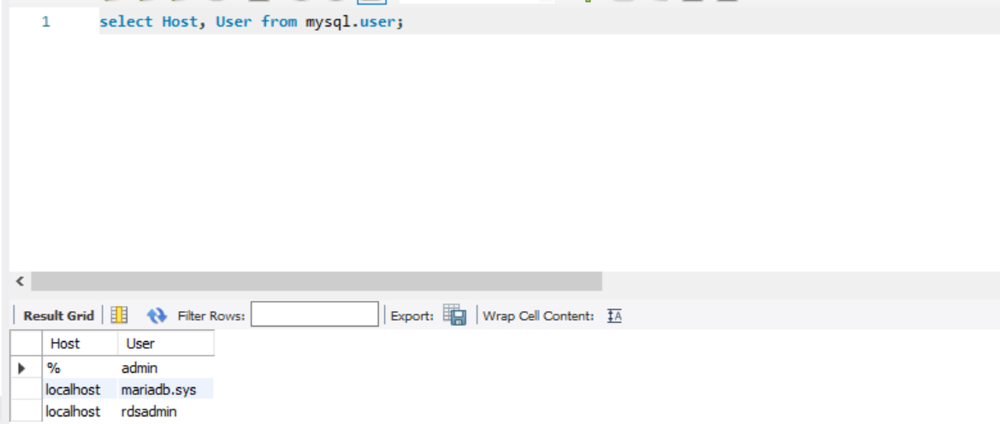
Erklären Sie wieso Sie besser einen PAAS oder SAAS Service verwenden anstatt eine eigene Datenbank zu installieren:
Es ist sicherer und weniger aufwändig: Da man nicht die Versionen und Infrastruktur selbst managen muss.
# B)
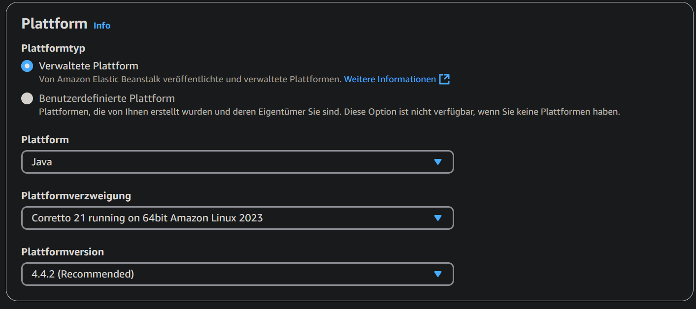
Ich habe eine Java Platform ausgewählt
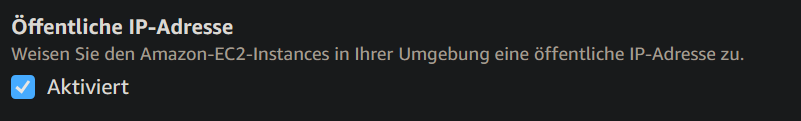
Man soll von aussen auf die App zugreifen können.
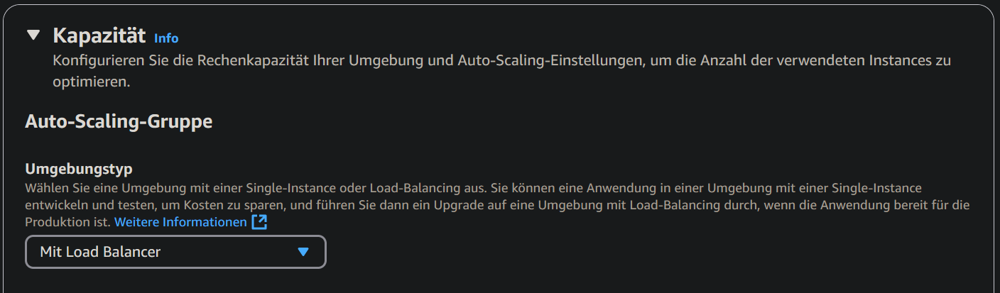
Load balancer auswählen
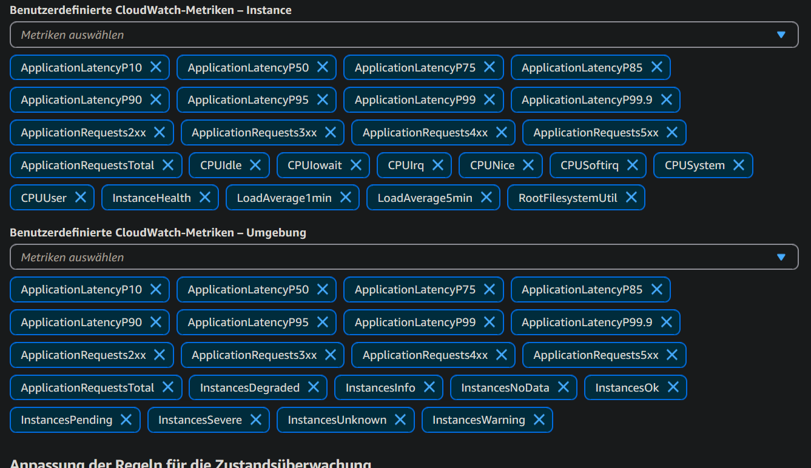
Alles auswählen
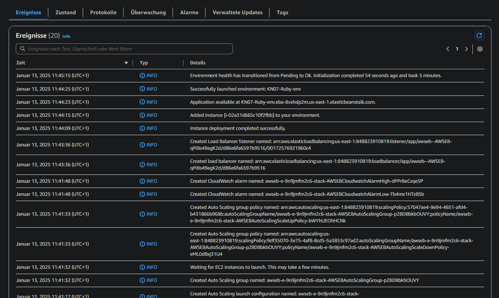
Es funktioniert!
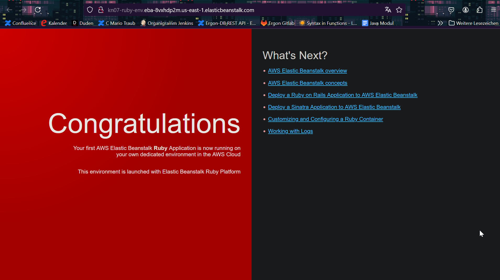
# C)
Instanz:
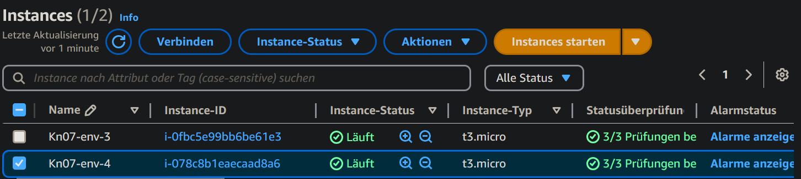
Load Balancer:
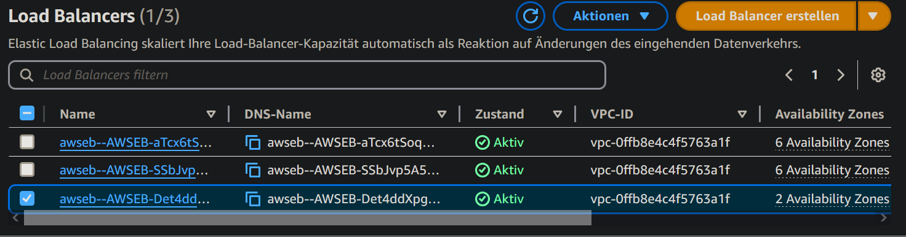
Target Group:
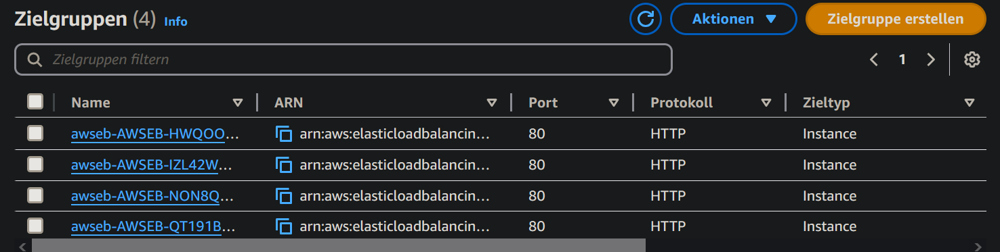
Auto Scaling:
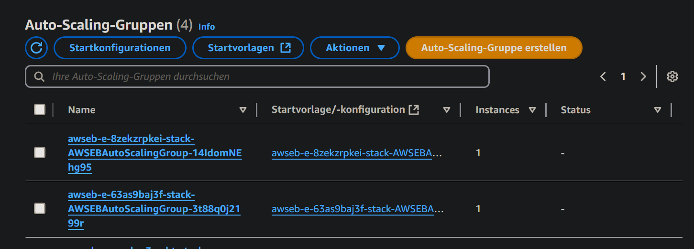

## Cloud formation
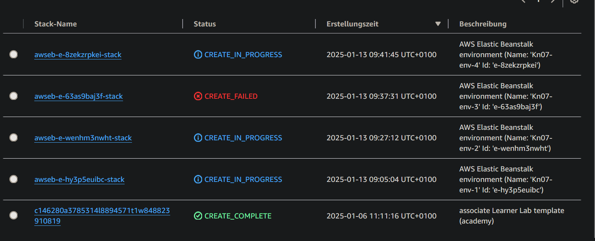

Cloud Formation ist wie cloud init, einfach nur für Amazon. Auf einer höheren Ebene:
Man kann auch Neztwerk... konfigurieren (Auf Infrastruktur Ebene)
