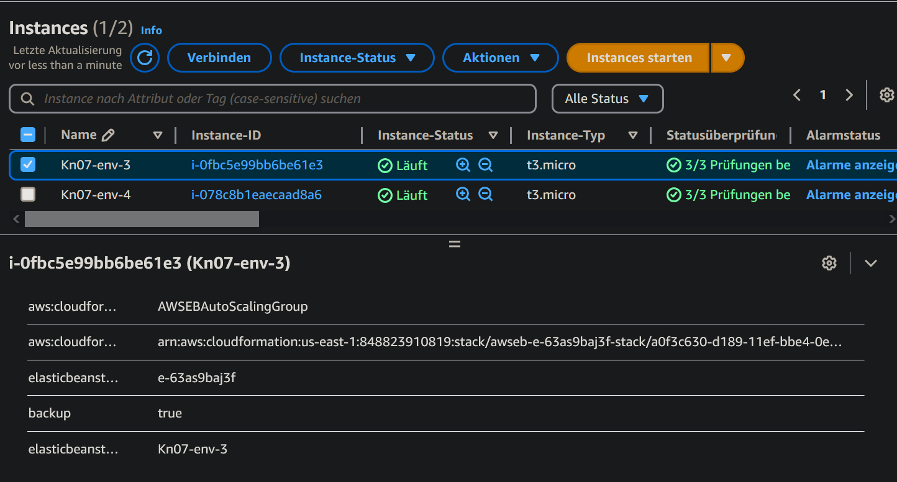
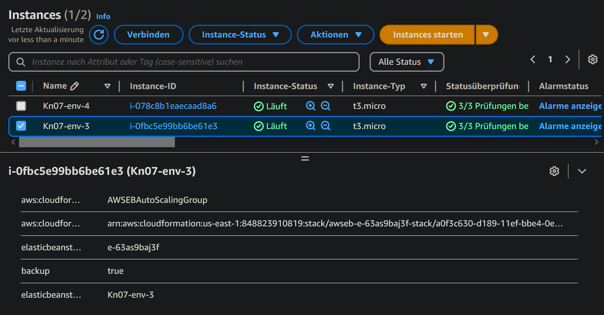
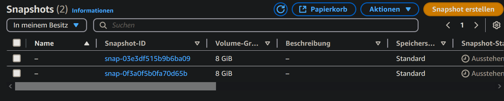
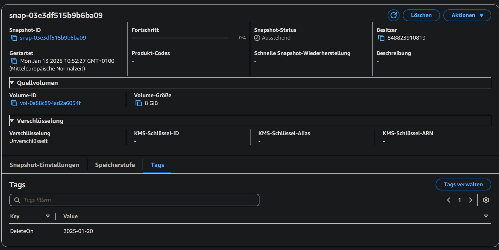
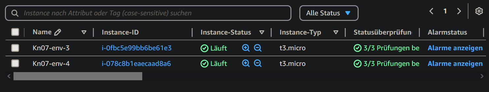

## Zeigen Sie den Screenshot ihrer Instanzen mit dem korrekten Tag

## Zeigen Sie einen Screenshot der Liste der erstellten Snapshots.

## Zeigen Sie einen Screenshot der Tags eines der erstellten Snapshots.

## Zeigen Sie einen Screenshot der Liste nachdem Sie das Cleanup ausgeführt haben.
### Mit unveränderten Tags

Wenn man den deleteOn Tag auf das heutige Datum setzt würden sie gelöscht werden.
