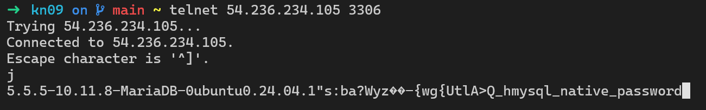

# A)
Ich musste noch die env Variable für die Region setzen: 

Statt die env Variable zu setzen kann man auch `aws configure` benutzen.

## Stoppen
```bash
aws ec2 stop-instances --instance-ids i-0ba9d00989a54f7d7
```

## Starten
```bash
aws ec2 start-instances --instance-ids i-0ba9d00989a54f7d7
```


## Neue Instanz erstellen
```bash
aws ec2 run-instances \
  --image-id ami-04b4f1a9cf54c11d0 \
  --instance-type t2.micro \
  --security-group-ids sg-090c83fade20b196b \
  --user-data file://cloud-init-db.yml \
  --tag-specifications 'ResourceType=instance,Tags=[{Key=Name,Value=KN09}]'
```

### Screenshot der Verbindung


## KN05 CMD
```
# Subnet
aws ec2 create-subnet --vpc-id vpc-081ec835f3EXAMPLE --cidr-block 10.0.0.0/24 --tag-specifications ResourceType=subnet,Tags=[{Key=Name,Value=subnet-kn08}]

# Sicherheitsgruppen
aws ec2 create-security-group \
  --group-name SG-MariaDB \
  --description "Security group for MariaDB database server"
aws ec2 authorize-security-group-ingress \
  --group-name SG-MariaDB \
  --protocol tcp \
  --port 3306 \
  --source-group sg-xxxxxxxxxx # Sicherheitsgruppe des Webservers

aws ec2 create-security-group \
  --group-name SG-Webserver \
  --description "Security group for web server"
aws ec2 authorize-security-group-ingress \
  --group-name SG-Webserver \
  --protocol tcp \
  --port 80 \
  --cidr 0.0.0.0/0

# Elastic IP
aws ec2 allocate-address --domain vpc
aws ec2 associate-address \
  --allocation-id eipalloc-0abcdef1234567890 \
  --instance-id i-0fbc5e99bb6be61e3
aws ec2 create-tags \
  --resources eipalloc-0abcdef1234567890 \
  --tags Key=Name,Value=IP-Web

# Instanzen
aws ec2 run-instances \
  --image-id ami-04b4f1a9cf54c11d0 \
  --instance-type t2.micro \
  --key-name MyKeyPair \
  --subnet-id subnet-0abc1234567890def \
  --security-group-ids sg-xxxxxxxxxx \
  --user-data file://cloud-init-db.yml \
  --private-ip-address 10.0.1.10 \
  --tag-specifications 'ResourceType=instance,Tags=[{Key=Name,Value=DB-Instance}]'

aws ec2 run-instances \
  --image-id ami-04b4f1a9cf54c11d0 \
  --instance-type t2.micro \
  --key-name MyKeyPair \
  --subnet-id subnet-0abc1234567890def \
  --security-group-ids sg-yyyyyyyyyy \
  --user-data file://cloud-init-web.yml \
  --private-ip-address 10.0.1.20 \
  --tag-specifications 'ResourceType=instance,Tags=[{Key=Name,Value=Web-Server}]'
```
