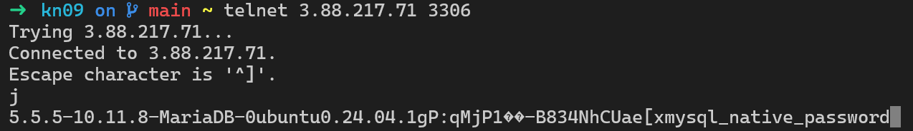

# A)
Ich musste noch die env Variable für die Region setzen: 

Statt die env Variable zu setzen kann man auch `aws configure` benutzen.

## Stoppen
```bash
aws ec2 stop-instances --instance-ids i-0ba9d00989a54f7d7
```

## Starten
```bash
aws ec2 start-instances --instance-ids i-0ba9d00989a54f7d7
```


## Neue Instanz erstellen
```bash
aws ec2 run-instances \
  --image-id ami-04b4f1a9cf54c11d0 \
  --instance-type t2.micro \
  --security-group-ids sg-090c83fade20b196b \
  --user-data file://cloud-init-db.yml \
  --tag-specifications 'ResourceType=instance,Tags=[{Key=Name,Value=KN09}]'
```

### Screenshot der Verbindung


## KN05 CMD
```bash
# Subnet
aws ec2 create-subnet --vpc-id vpc-081ec835f3EXAMPLE --cidr-block 10.0.0.0/24 --tag-specifications ResourceType=subnet,Tags=[{Key=Name,Value=subnet-kn08}]

# Sicherheitsgruppen
aws ec2 create-security-group \
  --group-name SG-MariaDB \
  --description "Security group for MariaDB database server"
aws ec2 authorize-security-group-ingress \
  --group-name SG-MariaDB \
  --protocol tcp \
  --port 3306 \
  --source-group sg-xxxxxxxxxx # Sicherheitsgruppe des Webservers

aws ec2 create-security-group \
  --group-name SG-Webserver \
  --description "Security group for web server"
aws ec2 authorize-security-group-ingress \
  --group-name SG-Webserver \
  --protocol tcp \
  --port 80 \
  --cidr 0.0.0.0/0

# Elastic IP
aws ec2 allocate-address --domain vpc
aws ec2 associate-address \
  --allocation-id eipalloc-0abcdef1234567890 \
  --instance-id i-0fbc5e99bb6be61e3
aws ec2 create-tags \
  --resources eipalloc-0abcdef1234567890 \
  --tags Key=Name,Value=IP-Web

# Instanzen
aws ec2 run-instances \
  --image-id ami-04b4f1a9cf54c11d0 \
  --instance-type t2.micro \
  --key-name MyKeyPair \
  --subnet-id subnet-0abc1234567890def \
  --security-group-ids sg-xxxxxxxxxx \
  --user-data file://cloud-init-db.yml \
  --private-ip-address 10.0.1.10 \
  --tag-specifications 'ResourceType=instance,Tags=[{Key=Name,Value=DB-Instance}]'

aws ec2 run-instances \
  --image-id ami-04b4f1a9cf54c11d0 \
  --instance-type t2.micro \
  --key-name MyKeyPair \
  --subnet-id subnet-0abc1234567890def \
  --security-group-ids sg-yyyyyyyyyy \
  --user-data file://cloud-init-web.yml \
  --private-ip-address 10.0.1.20 \
  --tag-specifications 'ResourceType=instance,Tags=[{Key=Name,Value=Web-Server}]'
```
### Ein paar Sätze zur Automatisierung. Was ist nun notwendig für die Automatisierung? Sie kennen die Befehle, können aber nicht einfach die Befehle in der Reihenfolge ausführen. Was ist notwendig? Wie gehen Sie vor?
Man müsste sich einige Parameter speichern für die IDs die vergeben werden und
diese dann in den weiteren Commands einfügen

# B)
[Terraform File](./main.tf)


## Terraform Befehle, die ich ausführen musste
```bash
terraform init

# Optional: Zeigt, was gemacht werden wird
terraform plan

terraform apply
```

## Bei Aufgabe A haben Sie argumentiert was von Ihrer Seite her noch notwendig ist für die Automatisierung. Wieso ist das bei Terraform nicht notwendig?
Die Parameter (vor allem IDs) werden von Terraform selbst gesetzt. Man kann die 
verschiedenen Elemente einfach durch ihre Namen verknüpfen.
