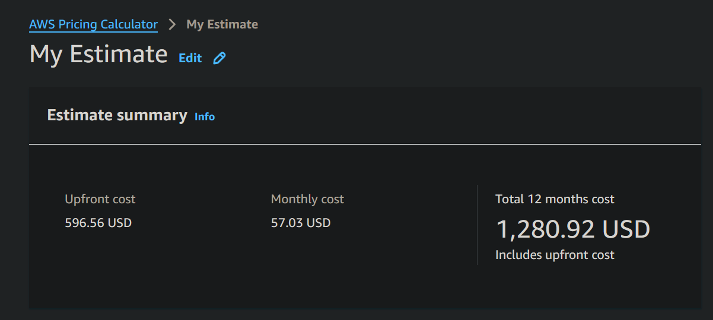
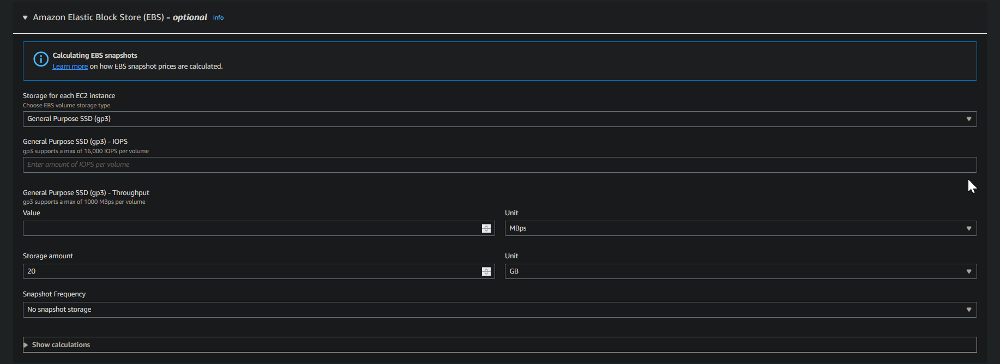
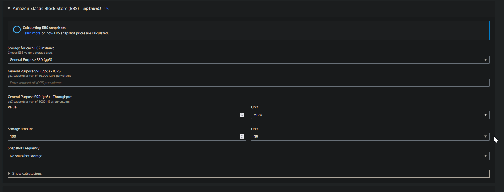
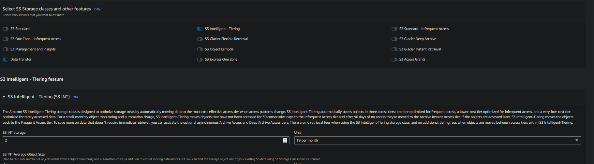
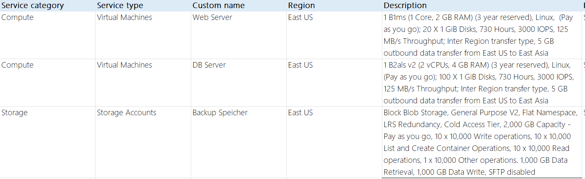
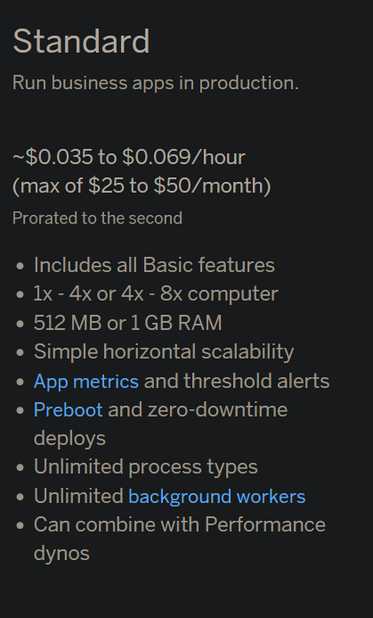
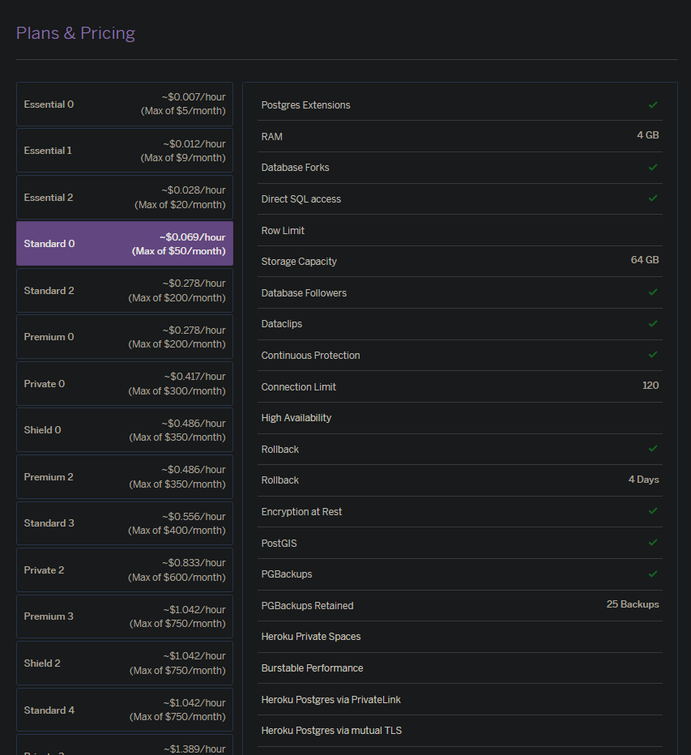
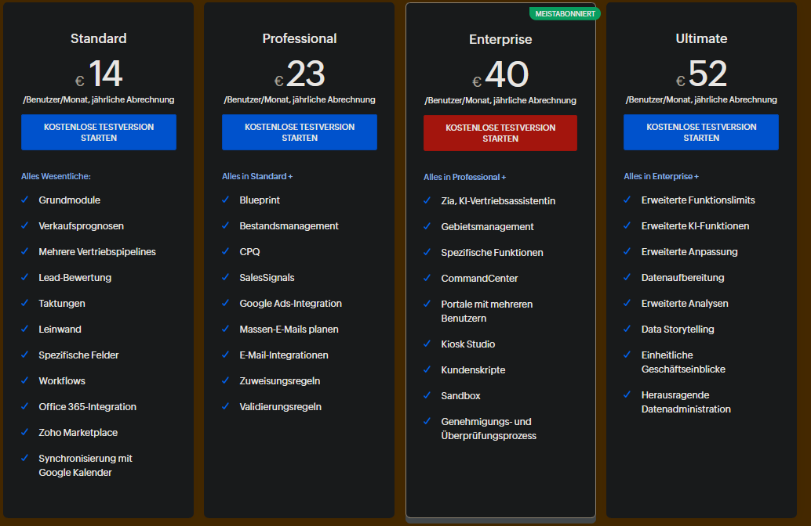
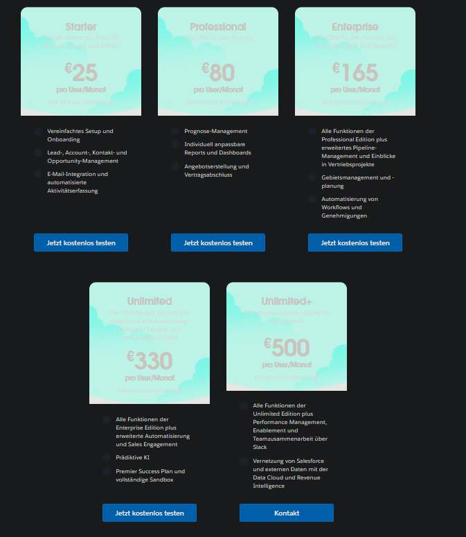

# A) IAAS
## AWS

### Webserver

Der t3a.small Typ hat die richtige Anzahl RAM, aber einen Core zuviel.
Es war aber nicht anders möglich in unserer Region

Wir haben wie gewünscht 20 GiB genommen
### DB-Server

Der t3.medium Typ hat die gewünschte anzahl Cores und RAM

Wir haben 100 GiB genommen wie gewünscht
### Backup speicher

Wir haben uns für einen S3 Storage entschieden für das Backup. Dort haben wir intelligent tierient gewählt.
Dadurch werden je nach dem wie oft der Speicher benutzt wird, die Kosten und der Plan angepasst.
### [Export](./aws-export.json)

## Azure

Beim DB- und Webserver habe ich einfach passende Instanzen ausgewählt,
die den Anforderungen entsprechen. 
Wir haben uns bei den Instanz für die Premium SSD v2 entschieden,
da man dort die genaue Diskgrösse angeben kann.
Ich habe mich beim Backup für einen Cold-Storage entschieden, da ich nicht denke,
dass man sehr oft auf die Daten zugreifen muss (wenn es gut läuft gar nicht).
### [Export](./azure-export.pdf)

# B) PAAS
## Webserver
Standard-2X:
~$0.06/hour (Max $50 pro Monat)

Dieser Plan hat zwar einen GB Ram zu wenig,
passt aber trotzdem am besten zu unseren Anforderungen
Das Betriebssystem kann nicht mehr selbst ausgewählt werden.

## DB
Heroku Postgres: Standard 0

Hier haben wir zwar etwas zu wenig Speicher, die nächste Stufe wäre aber viel teurer gewesen.
Backups sind auch darin integriert. 
Die Datenbank muss nicht selbst aufgesetzt werden und kann nur noch benutzt werden.
Man muss sich nicht mehr um das Betriebssystem kümmern.

# C) SAAS
## Zoho CRM

Ich würde das Standard wählen für 30 * 14 Euro, da es am günstigsten ist und ich nicht denke,
dass man die anderen Funktionen benötigt
## SalesForce Sales Cloud

Ich würde das den Starter Plan für 30 * 15 Euro wählen, da ich nicht denke,
dass man die anderen Funktionen benötigt.

Ich würde Zoho CRM wählen weil es billiger ist.

# D) Interpretation der Resultate
## Beachten Sie auch mögliche Kosten, die nicht in den Kalkulatoren abgedeckt sind. Wieso sind die Kosten unterschiedlich? Sind die Unterschiede gerechtfertigt?
- IAAS: 
    - Personalkosten für Migration
    - Downtime
    - Zugriff auf Backup
- PAAS:
    - Personalkosten für App-Anpassungen & migration
    - evtl. Migrationstools
- SAAS:
    - Personalkosten für Migration der Daten

Die Preisunterschiede sind gerechtfertigt, da wir nicht überall die selbe Hardware haben.
Heroku macht mehr für uns als zb. AWS.
## Aufwand für Ihre Firma. Welche Arbeit müssten Sie als Firma in die verschiedenen Migrationsvarianten investieren?
- IAAS: 
    - Betriebsysteme müssen aufgesetzt werden.
    - Netzwerk und Firewalls müssen konfiguriert werden.
- PAAS: 
    - App muss vielleicht angepasst werden.
- SAAS:
    - Daten müssen vielleicht migriert werden.
